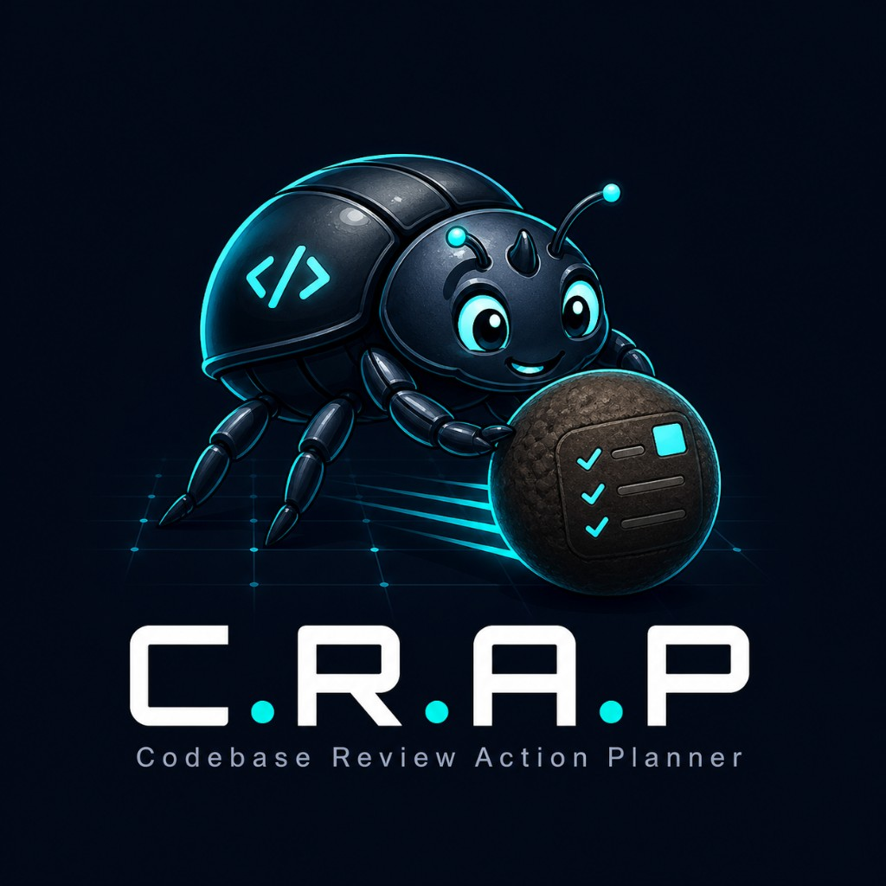

<div align="center">

# It's Your



### Review it. Fix it. Ship it.

**Powered by Cursor SDK**

[Watch the C.R.A.P. demo](assets/crapVideo.mp4)

</div>

# Codebase Review Action Planner, or C.R.A.P. for short

Standalone local review tool for inspecting web apps and codebases, selecting visible regions, adding annotations, and saving a review folder with Markdown, screenshots, payload JSON, and an optional Cursor SDK investigation report.

Run C.R.A.P. alongside your app or codebase locally so you can quickly identify bugs, leave detailed comments, take screenshots, annotate them, and let Cursor evaluate the evidence. It organizes everything into a neat local folder, then gives you a handoff prompt you can paste into Cursor to investigate, plan, and make whatever changes, additions, or edits are needed.

This C.R.A.P. will help you turn messy review sessions into action-ready evidence. When someone asks, "Who made this C.R.A.P.?", the answer is right in the review metadata.

## Why This Exists

This C.R.A.P. was built in a couple of hours because managing a lot of codebases creates a very specific kind of pain: screenshots live in one place, notes live somewhere else, browser context disappears, and the next person or agent has to guess what you were trying to report.

The goal is simple: capture the issue while it is still fresh, save all the evidence into one local folder, and generate a prompt that tells Cursor exactly what happened and where to look.

With the Cursor SDK available, this became an easy call. Cursor has built one of the strongest agent harnesses for real coding work, and it keeps improving how developers use models to inspect, explain, build, and fix software. C.R.A.P. is a small local layer on top of that idea: collect better evidence first, then hand it to an agent in a way that is useful.

## What It Is

C.R.A.P. is a local review tool for codebase and app review work. It does not replace your issue tracker, test runner, or browser DevTools. It gives you a structured place to capture what you saw, where you saw it, screenshots/annotations, and the notes another developer or AI coding agent needs to turn the observation into an investigation plan.

## What A Review Means

A review is one saved capture session. For example: you load a local app, inspect a broken screen, box-select the problem area, annotate a screenshot, add notes, and click **Save This C.R.A.P.** That saved folder is one review.

Each review is meant to answer:

- What app/site was being inspected?
- Who captured the evidence?
- What screen, element, or region looked wrong?
- What screenshots and annotations prove it?
- What should Cursor or another agent read next?

## How To Use It

1. Start the local server with `npm start`.
2. Open `http://localhost:8088/` or `http://127.0.0.1:8088/`.
3. Enter the Reference Base URL you want to inspect, usually another local app like `http://localhost:3000`.
4. Click **Lock and Load**, then open the drawer.
5. Use **Select Element** when the browser allows same-origin inspection, or **Box Select** when it does not.
6. Add notes and annotations for each captured section.
7. Click **Save This C.R.A.P.**
8. Open the saved folder or copy the generated Cursor handoff prompt.

For local apps, C.R.A.P. automatically aligns `localhost` and `127.0.0.1` to the hostname you used to open the board. Paths are preserved, so an admin dash URL like `http://localhost:3000/admin` stays on `/admin` while avoiding local login-cookie weirdness.

## Features

- Single-page C.R.A.P. board UI in `capture-board.html`
- Standalone Node backend in `server.js`
- Review artifact folders saved under `submissions/`
- Screenshot upload and per-section notes
- Light/dark mode
- In-drawer site loading for same-browser review flows
- Box selection and annotation tools
- Copy/export C.R.A.P. Markdown
- Optional Cursor SDK AI report generation
  - If you do not want your codebase to be actual CRAP, this part is only technically optional.
- Deterministic fallback report when Cursor SDK or `CURSOR_API_KEY` is unavailable
- Cursor handoff prompt generated after every save so another agent knows what was captured and where to inspect it
- Project Cursor skill at `.cursor/skills/look-at-this-crap/SKILL.md` for turning saved C.R.A.P. folders into action-ready Cursor investigations

## Requirements

- Node.js 20 or newer

## Cursor Skill: Look At This CRAP

This repo includes a project skill named `look-at-this-crap`. When C.R.A.P. saves a review, the generated `cursor-prompt.md` tells Cursor to use that skill if it is available.

The skill teaches Cursor how to read a saved C.R.A.P. folder, verify the screenshots, notes, payload, manifest, and AI/fallback report, then produce a code-backed investigation report before touching any code.

If you copy C.R.A.P. into another repo, keep this folder with it:

```text
.cursor/
  skills/
    look-at-this-crap/
      SKILL.md
```

## Where To Install It

C.R.A.P. is designed to run beside an application, not inside the application's runtime code.

Recommended layout for one project:

```text
my-project/
  app/                         # your real app
  tools/
    codebase-review-action-planner/
      capture-board.html
      server.js
      package.json
      submissions/
```

Recommended layout for many projects:

```text
dev-tools/
  codebase-review-action-planner/
    capture-board.html
    server.js
    package.json
    submissions/

my-project-a/
my-project-b/
```

On a server such as `/var/www`, keep it in a tools folder rather than the web root:

```text
/var/www/
  my-app/
  standalone-tools/
    codebase-review-action-planner/
```

Avoid placing it here:

```text
my-project/src/
my-project/frontend/
my-project/backend/
my-project/public/
```

Those locations can accidentally ship C.R.A.P. with your production app. This is local review tooling, so keep it separate.

## Should It Be Gitignored?

Always gitignore the generated/local pieces:

```gitignore
tools/codebase-review-action-planner/node_modules/
tools/codebase-review-action-planner/.env
tools/codebase-review-action-planner/.env.*
tools/codebase-review-action-planner/submissions/*
!tools/codebase-review-action-planner/submissions/.gitkeep
```

Whether you gitignore the tool itself depends on how you use it:

- **Personal-only local tool:** gitignore the whole folder.

  ```gitignore
  tools/codebase-review-action-planner/
  ```

- **Team-shared project tool:** commit the tool files, but keep `node_modules/`, `.env`, and `submissions/` ignored.

  ```text
  commit:
    tools/codebase-review-action-planner/capture-board.html
    tools/codebase-review-action-planner/server.js
    tools/codebase-review-action-planner/package.json
    tools/codebase-review-action-planner/README.md
    tools/codebase-review-action-planner/LICENSE
    tools/codebase-review-action-planner/.env.example
    tools/codebase-review-action-planner/submissions/.gitkeep

  ignore:
    tools/codebase-review-action-planner/node_modules/
    tools/codebase-review-action-planner/.env
    tools/codebase-review-action-planner/submissions/*
  ```

Default recommendation: if only you use it, keep it outside the app repo or gitignore the whole folder. If the team should use the same C.R.A.P. workflow, commit the tool code and ignore only local output/secrets.

## Install

```bash
npm install
```

If you are copying this into an existing app repo, copy the whole folder into `tools/codebase-review-action-planner/`, then run:

```bash
cd tools/codebase-review-action-planner
npm install
```

`@cursor/sdk` is optional. The app still runs without it, but AI reports will use fallback mode until the SDK and a Cursor API key are available.

## Run This C.R.A.P.

```bash
npm start
```

Default local URL:

```text
http://127.0.0.1:8088/
```

The root URL serves the board. The actual file is still available directly at `http://127.0.0.1:8088/capture-board.html` if you want the explicit HTML path.

This tool is intended for local-only use. It binds to `127.0.0.1`, not a public interface.

Health check:

```text
http://127.0.0.1:8088/health
```

## Configuration

Copy `.env.example` to `.env` and edit values as needed:

```bash
cp .env.example .env
```

Common settings:

```bash
PORT=8088
REVIEW_TOKEN=
CURSOR_API_KEY=
QA_CURSOR_MODEL=composer-2
```

If `REVIEW_TOKEN` is blank, saves are allowed without a token. If it is set, the page must submit the same token. This is only a lightweight local gate, not full authentication.

If `CURSOR_API_KEY` is blank or the Cursor SDK fails, the server still writes `ai-report.md` using local fallback mode.

## Saved C.R.A.P.

Each save creates a folder like:

```text
submissions/20260501T160800Z-codebase-review/
  ai-report.json
  ai-report.md
  browser-export.md
  cursor-prompt.md
  manifest.md
  payload.json
  screenshots/
  summary.md
```

After saving from the browser, the page also displays the generated Cursor prompt with a copy button. Paste that prompt into Cursor when you want it to inspect the saved folder and turn the evidence into an investigation report or implementation plan.

The server also exposes saved submissions locally:

```text
http://127.0.0.1:8088/submissions/
```

## API

Save a review:

```http
POST /api/reviews
Content-Type: application/json
```

The server also accepts `POST /v1/qa-artifacts/checklist` for compatibility with older capture-board builds.

## Security Notes

- This project is currently local-only software.
- There is no full authentication or user/session system baked in yet.
- The server binds to `127.0.0.1`; normal setup only changes `PORT`.
- Keep `.env` out of git.
- Do not expose this directly to the public internet.
- Saved screenshots may contain private application data.
- `submissions/` is intentionally gitignored except for `.gitkeep`.

## License

MIT. See `LICENSE`.
